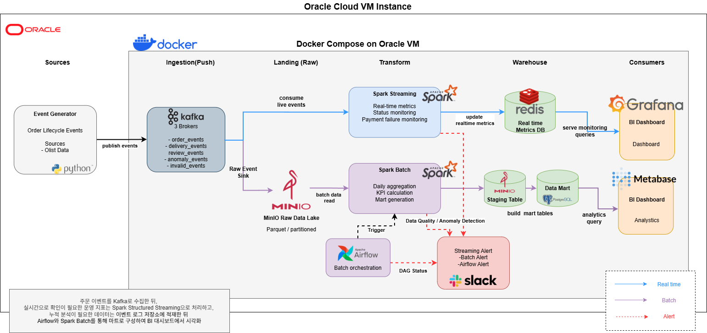

# 🛒 E-Commerce Hybrid Data Pipeline Project
## 아키텍처 구조
  
        

---

## 1. 📌 프로젝트 개요

본 프로젝트는 정적인 CSV 기반 이커머스 데이터를 **이벤트 기반 스트리밍 데이터 구조로 변환**하고,  
Kafka를 중심으로 데이터 파이프라인을 구축하는 것을 목표로 한다.

Olist 이커머스 데이터를 활용하여 주문, 배송, 리뷰 데이터를 이벤트 형태로 생성하고,  
이를 Kafka를 통해 전달한 후 Consumer를 통해 저장하는 구조를 구현하였다.

### 🎯 주요 목표

- 배치 데이터를 이벤트 스트림 형태로 변환
- Kafka 기반 데이터 수집 파이프라인 구축
- 실시간 데이터 처리 구조 설계
- 이후 Spark 및 BI 분석을 위한 데이터 기반 마련

---

## 2. 🗂️ 프로젝트 구조

```text
Meta_Pipeline/
├── data/
│   ├── raw/                 # 원본 Olist 데이터
│   ├── event_source/        # 이벤트 생성 데이터 (JSONL)
│   ├── sink/                # Kafka Consumer 저장 결과
│
├── kafka/
│   ├── docker-compose.yml   # Kafka, Zookeeper, UI 설정
│   ├── producer/            # Kafka Producer
│   ├── consumer/            # Kafka Consumer (파일 저장)
│
├── origin_data_processing/
│   └── jobs/                # 이벤트 생성 스크립트
│
└── README.md
```
### 2. 🗂️ 최종 프로젝트 구조(예정)

```text
Meta_Pipeline/
├── docker-compose.yml              # 전체 컨테이너 통합 실행 설정
├── README.md
├── requirements.txt
├── .env                            # 환경변수 설정
├── .gitignore
│
├── data/
│   ├── raw/                        # 원본 Olist CSV 데이터
│   ├── event_source/               # Kafka Producer 입력용 이벤트 JSONL
│   ├── sink/                       # Kafka Consumer 저장 결과
│   ├── checkpoint/                 # Spark Streaming checkpoint
│   └── warehouse/                  # Spark 처리 결과 저장 영역
│
├── origin_data_processing/
│   └── jobs/                       # 원본 CSV → 이벤트 데이터 생성 스크립트
│
├── kafka/
│   ├── producer/                   # Kafka Producer 코드
│   ├── consumer/                   # Kafka Consumer 코드
│   └── config/                     # Kafka 관련 설정 파일
│
├── spark/
│   ├── batch/                      # Spark Batch 처리 작업
│   ├── streaming/                  # Spark Structured Streaming 작업
│   ├── jobs/                       # 공통 Spark Job 스크립트
│   └── config/                     # Spark 설정 파일
│
├── airflow/
│   ├── dags/                       # Airflow DAG 파일
│   ├── logs/                       # Airflow 실행 로그
│   └── plugins/                    # Airflow 커스텀 플러그인
│
├── db/
│   ├── init/                       # DB 초기화 SQL
│   └── models/                     # 테이블 설계 및 데이터 모델링 문서
│
├── notebooks/                      # 실험 및 데이터 탐색용 노트북
│
├── docs/
│   ├── architecture/               # 아키텍처 다이어그램
│   ├── event_schema/               # 이벤트 스키마 문서
│   └── data_modeling/              # Fact / Dimension 설계 문서
│
└── scripts/                        # 실행 보조 스크립트
```

---

## 3. 🔄 데이터 흐름 (Data Flow)

```text
1. 원본 데이터 (CSV - Olist)
    ↓
2. 이벤트 생성 (PySpark / Python)
    - 주문 / 배송 / 리뷰 데이터를 이벤트 형태(JSONL)로 변환
    ↓
3. Kafka Producer
    - 생성된 이벤트를 Kafka Topic으로 전송
    ↓
4. Kafka Cluster
    - order-events
    - delivery-events
    - review-events
    ↓
5. Kafka Consumer
    - 이벤트를 구독하여 데이터 수신
    ↓
6. Sink 저장
    - JSONL 파일 형태로 로컬 저장 (data/sink)
```

---

## 4. 🧰 사용 기술 (Tech Stack)

### 📦 Data Processing


---

### 🚀 Data Streaming


---

### 🐳 Infrastructure


---

### 📊 Data Format


---

### 🛠️ Development / Utility


